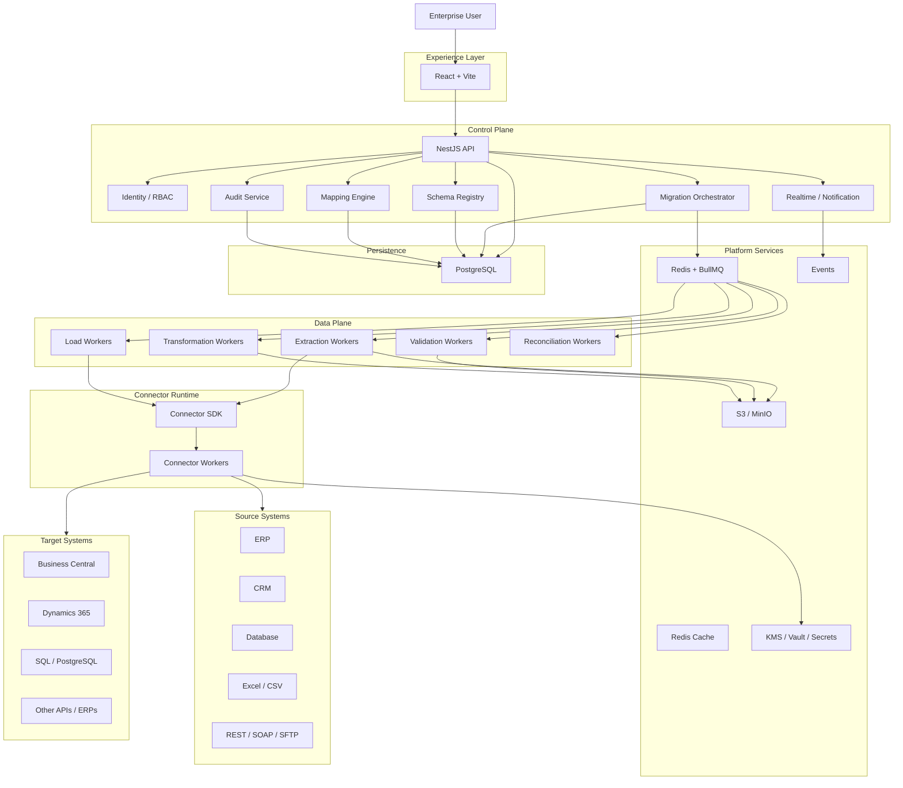

# EDIMP Platform — Enterprise Architecture Optimization & Scale-Up Plan

## 1. Executive Summary

The current EDIMP architecture is a solid prototype/MVP foundation:

- React + Vite + Tailwind frontend
- NestJS backend
- PostgreSQL + Prisma
- JWT authentication
- WebSocket-based updates
- Modular backend/domain structure

However, the current design should **not be treated as the final enterprise production architecture** for a large-scale data migration platform.

The primary architectural change is:

> **NestJS should act primarily as the Control Plane / orchestration layer. Migration execution should run in dedicated, durable worker processes.**

The recommended target architecture is:

```text
React Web
   |
   | HTTPS / WebSocket / SSE
   v
NestJS Control Plane
   |
   +---- PostgreSQL (metadata/control data)
   |
   +---- Redis + BullMQ (job orchestration)
   |
   +---- Object Storage (S3 / MinIO / Azure Blob)
   |
   +---- Secrets / KMS / Vault
   |
   v
Distributed Worker Layer
   |
   +---- Extraction Workers
   +---- Validation Workers
   +---- Transformation Workers
   +---- Loading Workers
   +---- Reconciliation Workers
   +---- Connector Workers
   |
   v
Enterprise Systems
   |
   +---- Business Central
   +---- Dynamics 365
   +---- SAP
   +---- Salesforce
   +---- PostgreSQL
   +---- SQL Server
   +---- REST/SOAP APIs
   +---- Excel/CSV/SFTP
```

The target design should emphasize:

- Horizontal scalability
- Tenant isolation
- Durable asynchronous execution
- Checkpointing
- Idempotency
- Retry and backoff
- Large dataset handling
- Connector isolation
- Data lineage
- Reconciliation
- Auditability
- Observability
- Security
- Disaster recovery
- Cost-efficient growth

---

# 2. Current Architecture Assessment

| Area | Current State | Assessment | Target |
|---|---|---|---|
| Frontend | React SPA | Good | Keep |
| Frontend routing | React Router planned | Good | Implement |
| Frontend server state | React Query planned | Good | Implement |
| Frontend UI state | Zustand planned | Good | Implement |
| Backend | NestJS | Good | Keep |
| ORM | Prisma | Good | Keep for metadata/control plane |
| Database | PostgreSQL | Good | Keep |
| Auth | JWT HttpOnly cookies | Reasonable | Add enterprise IAM/SSO |
| Migration execution | Inside backend conceptually | Risk | Dedicated workers |
| Queue | Missing | Critical gap | Redis + BullMQ |
| Object storage | Missing | Critical gap | S3 / MinIO / Blob |
| Checkpointing | Missing | Critical gap | Add |
| Idempotency | Missing | Critical gap | Add |
| Reconciliation | Basic/undefined | Gap | Add |
| Connector isolation | Limited | Risk | Connector SDK + workers |
| Tenant isolation | Mentioned | Needs stronger design | tenant_id + RLS/DB isolation |
| Secrets | DB encryption | Good start | KMS/Vault/Secrets Manager |
| Telemetry | WebSocket/logging | Incomplete | OpenTelemetry |
| Audit | Not fully defined | Gap | Immutable audit trail |
| Data lineage | Missing | Gap | Add |
| DR | Missing | Gap | Add |
| Horizontal scaling | Limited | Risk | API/worker independent scaling |
| Analytics | Same DB likely | Risk | Reporting views/store |
| Large Excel/file processing | Missing | Critical gap | Object storage + ingestion workers |

---

# 3. Core Architectural Principle: Control Plane vs Data Plane

## 3.1 Control Plane

The Control Plane should manage:

- Authentication
- Tenants
- Users
- RBAC
- SSO configuration
- Connector registration
- Connector metadata
- Migration projects
- Migration jobs
- Schema registry
- Mapping definitions
- Mapping versions
- Approvals
- Billing
- Audit
- Notification
- Dashboard metadata
- Job state
- Orchestration

NestJS belongs primarily here.

## 3.2 Data Plane

The Data Plane should perform:

- Extraction
- File parsing
- Schema discovery
- Data profiling
- Validation
- Data cleansing
- Transformation
- Batching
- Loading
- Retry
- Checkpointing
- Reconciliation
- Large dataset processing

Workers belong here.

## 3.3 Why this separation matters

If 10 million records are processed in the same process handling API traffic:

- API latency will suffer
- memory pressure will increase
- CPU contention will increase
- deployment becomes risky
- one bad connector can affect the whole application
- worker scaling cannot be independent
- retry behavior becomes difficult to control

The Control Plane/Data Plane design allows:

```text
API scale:
2 -> 5 -> 10 replicas

Worker scale:
2 -> 10 -> 50 replicas
```

independently.

---

# 4. Recommended Target Architecture



---

# 5. Job Queue Architecture

A durable queue is mandatory for EDIMP.

Recommended initial technology:

- Redis
- BullMQ
- NestJS BullMQ integration

Suggested queues:

```text
extraction.queue
validation.queue
transformation.queue
loading.queue
reconciliation.queue
notification.queue
cleanup.queue
```

## Queue requirements

Every queue should support:

- Persistent jobs
- Retry
- Exponential backoff
- Delayed execution
- Priority
- Concurrency control
- Rate limiting
- Dead-letter handling
- Job dependencies
- Cancellation
- Pause/resume
- Observability

Example workflow:

```text
Migration Job
   |
   +--> Extract
   |
   +--> Validate
   |
   +--> Transform
   |
   +--> Load
   |
   +--> Reconcile
   |
   +--> Report
```

---

# 6. Object Storage

PostgreSQL should not become the storage location for large migration datasets.

Use:

- Amazon S3
- MinIO
- Azure Blob Storage

A logical structure:

```text
/raw/
  /tenant/{tenantId}/
    /migration/{migrationId}/
      /customers/
      /vendors/
      /invoices/
      /items/

/staging/
  /tenant/{tenantId}/
    /migration/{migrationId}/

/validated/
  /tenant/{tenantId}/
    /migration/{migrationId}/

/failed/
  /tenant/{tenantId}/
    /migration/{migrationId}/

/reports/
  /tenant/{tenantId}/
    /migration/{migrationId}/
```

Store:

- Excel files
- CSV files
- JSON
- raw extracts
- transformed datasets
- rejected data
- generated reports
- reconciliation exports

PostgreSQL should keep metadata and references to these artifacts.

---

# 7. Excel / CSV Migration Pipeline

Excel migration should be a first-class ingestion pipeline.

Recommended workflow:

```text
User Upload
    |
    v
Object Storage
    |
    v
File Validation
    |
    v
Parsing Worker
    |
    v
Canonical Dataset
    |
    v
Schema Detection
    |
    v
Data Profiling
    |
    v
Validation
    |
    v
Transformation
    |
    v
Approval
    |
    v
Target Load
    |
    v
Reconciliation
```

Example UI result:

```text
Total Records     1,250,000
Valid             1,217,540
Warnings             21,430
Errors              11,030

Status: Ready for Migration
```

Large files should never be routed through the browser application server unnecessarily.

---

# 8. Migration Job Domain Model

The current `MigrationJob` model is too small for enterprise workloads.

Recommended entities:

```text
Tenant
User
MigrationProject
MigrationJob
MigrationRun
MigrationStage
MigrationBatch
MigrationRecord
MigrationError
MigrationCheckpoint
MigrationArtifact
MigrationApproval
MigrationReconciliation
MigrationEvent
MappingDefinition
MappingVersion
SchemaDefinition
Connector
ConnectorCredentialReference
AuditLog
```

Suggested hierarchy:

```text
MigrationProject
    |
    +-- Source Connector
    +-- Target Connector
    +-- Schema
    +-- Mapping Version
    |
    +-- Migration Jobs
            |
            +-- Run
            +-- Stage
            +-- Batch
            +-- Record Result
            +-- Errors
            +-- Checkpoints
            +-- Reconciliation
```

---

# 9. Checkpointing

A production migration must be resumable.

Example:

```text
Batch 001   SUCCESS
Batch 002   SUCCESS
Batch 003   SUCCESS
Batch 004   SUCCESS
Batch 005   FAILED
Batch 006   PENDING
```

After remediation:

```text
Resume from Batch 005
```

not:

```text
Restart Batch 001 -> 006
```

Checkpoint fields should include:

```text
job_id
stage
batch_number
source_cursor
last_processed_key
records_processed
worker_id
status
created_at
updated_at
```

Checkpoint strategy should support:

- Keyset pagination
- Source cursor continuation
- Page number where safe
- Timestamp/watermark where appropriate
- Connector-specific continuation token

Avoid relying solely on offset pagination for large datasets.

---

# 10. Idempotency

EDIMP must be designed for at-least-once processing.

A worker may successfully call a target API and then crash before marking the operation successful.

The retry must not create duplicates.

Use an idempotency key derived from:

```text
tenant_id
source_system
source_entity
source_record_id
target_system
migration_project
```

Example:

```text
EDIMP-{tenant}-{entity}-{sourceRecordId}-{target}
```

Possible database constraint:

```text
UNIQUE (
    tenant_id,
    source_system,
    source_entity,
    source_record_id,
    target_system
)
```

Where practical, use target-system native idempotency/upsert capabilities as well.

---

# 11. Canonical Data Model

A major strategic opportunity for EDIMP is a canonical model.

Instead of:

```text
ERP A -> ERP B
ERP C -> ERP B
ERP D -> ERP B
```

use:

```text
ERP A ----\
ERP B -----\
Excel ------> Canonical Model ---> Target
ERP C -----/
ERP D ----/
```

Candidate canonical entities:

```text
Customer
Vendor
Item
Employee
ChartOfAccounts
Warehouse
Currency
TaxCode
SalesOrder
PurchaseOrder
Invoice
InvoiceLine
Payment
Journal
Asset
```

Benefits:

- Reduced connector complexity
- Reusable transformation logic
- Better data governance
- Easier testing
- Easier future connector additions
- Improved data lineage
- Easier reporting

---

# 12. Connector SDK

Create a standardized Connector SDK.

Example source contract:

```typescript
interface SourceConnector {
  testConnection(): Promise<Result>;
  discoverSchema(): Promise<Schema>;
  extract(request: ExtractRequest): AsyncIterable<Record>;
  supportsPagination(): boolean;
  supportsIncrementalSync(): boolean;
  supportsCDC(): boolean;
  getRateLimits(): RateLimit;
}
```

Example target contract:

```typescript
interface TargetConnector {
  testConnection(): Promise<Result>;
  validate(record: Record): Promise<ValidationResult>;
  insertBatch(records: Record[]): Promise<LoadResult>;
  updateBatch(records: Record[]): Promise<LoadResult>;
  upsertBatch(records: Record[]): Promise<LoadResult>;
}
```

Each connector should expose capabilities.

Example:

```text
BusinessCentralConnector
  supportsPagination
  supportsBatching
  supportsUpsert
  supportsIncremental
  rateLimit
```

---

# 13. Connector Worker Isolation

Avoid loading every connector implementation directly into the main API runtime.

Recommended model:

```text
EDIMP API
   |
   v
Queue
   |
   +--> Business Central Worker
   +--> Dynamics Worker
   +--> Salesforce Worker
   +--> PostgreSQL Worker
   +--> SQL Server Worker
   +--> Excel Worker
   +--> REST Worker
```

Initially these can be Node.js worker processes.

As the platform grows, connector runtimes can be independently deployed/scaled.

---

# 14. Connector Rate Limiting

Every connector should support configuration like:

```text
maxConcurrency
requestsPerSecond
batchSize
timeout
retryCount
backoff
circuitBreakerThreshold
```

Example:

```text
429 Too Many Requests
      |
      v
Exponential Backoff
      |
      v
Retry
      |
      +-- still failing --> Dead Letter / Pause
```

Connector failures should not take down the main API.

---

# 15. Real-Time Progress Architecture

WebSockets are useful, but do not stream every record event to the browser.

Avoid:

```text
record 1 processed
record 2 processed
record 3 processed
...
record 1,000,000 processed
```

Instead publish aggregated progress:

```json
{
  "jobId": "JOB123",
  "stage": "LOAD",
  "processed": 450000,
  "total": 1000000,
  "errors": 120,
  "throughput": 1850,
  "timestamp": "2026-08-17T00:00:00Z"
}
```

Recommended path:

```text
Worker
  |
  v
Event / Redis
  |
  v
Realtime Gateway
  |
  v
WebSocket / SSE
  |
  v
React
```

---

# 16. Event-Driven Model

Use domain events where helpful.

Suggested events:

```text
MigrationCreated
MigrationQueued
ExtractionStarted
ExtractionCompleted
ValidationStarted
ValidationCompleted
TransformationStarted
TransformationCompleted
LoadStarted
LoadCompleted
MigrationPaused
MigrationFailed
MigrationCompleted
ReconciliationCompleted
```

Start with Redis/BullMQ.

Do not introduce Kafka/Redpanda until actual scale and event architecture justify it.

---

# 17. PostgreSQL Responsibilities

Use PostgreSQL for:

- Tenant metadata
- Users
- Roles
- Connectors
- Connector references
- Migration projects
- Migration jobs
- Job states
- Mapping definitions
- Mapping versions
- Schema metadata
- Checkpoints
- Error metadata
- Reconciliation summaries
- Audit metadata

Do not use PostgreSQL as a dumping ground for every raw migration record if object storage is more suitable.

---

# 18. Prisma Usage Strategy

Prisma is appropriate for:

- Users
- Tenants
- Jobs
- Configuration
- Metadata
- Audit records
- Schema/mapping configuration

For bulk data movement, consider:

- PostgreSQL `COPY`
- Native bulk inserts
- Database-specific bulk loaders
- Native SQL when appropriate
- Target-specific bulk APIs

Do not create/disconnect PrismaClient for every request or record.

Reuse a long-lived client in long-running processes and use connection pooling appropriately.

---

# 19. Database Indexing

Index based on real query patterns.

Typical indexes:

```text
MigrationJob:
(tenant_id, created_at)
(tenant_id, status)
(project_id, created_at)

MigrationError:
(job_id, severity)
(tenant_id, job_id)

MigrationBatch:
(job_id, batch_number)
(job_id, status)

AuditLog:
(tenant_id, created_at)
(tenant_id, actor_id)
```

Do not over-index tables without evidence.

---

# 20. Partitioning

Large tables may eventually include:

```text
MigrationEvent
MigrationError
AuditLog
MigrationRecord
```

Partitioning can be introduced when scale justifies it.

Possible strategies:

- By time
- By tenant tier
- By job
- Hybrid approaches

Example:

```text
migration_events
  |
  +-- 2026_01
  +-- 2026_02
  +-- 2026_03
  +-- ...
```

Do not partition every table on day one.

---

# 21. Tenant Architecture

Every tenant-owned entity should carry:

```text
tenant_id
```

Conceptual model:

```text
Tenant
  |
  +-- Users
  +-- Connectors
  +-- Projects
  +-- Jobs
  +-- Schemas
  +-- Mappings
  +-- Reports
  +-- Audit
```

Application layer:

```text
Every request
  |
  v
Resolve tenant
  |
  v
Authorize tenant
  |
  v
Tenant-scoped query
```

For stronger protection, evaluate PostgreSQL Row Level Security (RLS).

---

# 22. Tenant Isolation Tiers

Support multiple enterprise isolation models.

## Tier 1 — Shared

```text
Shared API
Shared workers
Shared DB
tenant_id + RLS
```

## Tier 2 — Dedicated Database

```text
Customer
  |
  +-- Dedicated PostgreSQL
```

## Tier 3 — Dedicated Environment

```text
Customer
  |
  +-- Dedicated VPC
  +-- Dedicated API
  +-- Dedicated workers
  +-- Dedicated database
```

This provides commercial flexibility for different enterprise/security tiers.

---

# 23. Authentication and IAM

JWT HttpOnly cookies are acceptable for initial deployments.

For enterprise customers, support:

```text
OIDC
OAuth 2.0
SAML
Microsoft Entra ID
Okta
Google Workspace
```

Recommended roles:

```text
PlatformAdmin
TenantAdmin
MigrationManager
DataEngineer
Reviewer
Operator
Viewer
```

Eventually add fine-grained permissions/ABAC where required.

---

# 24. Secrets Management

Current approach:

```text
Encrypt connector credentials before storing in DB
```

is a good starting point.

Enterprise target:

```text
EDIMP
   |
   v
Secret Manager / KMS / Vault
   |
   v
Encrypted Secret
```

Examples:

- Azure Key Vault
- AWS KMS + Secrets Manager
- GCP Secret Manager
- HashiCorp Vault

Whenever practical, PostgreSQL should store only:

```text
secret_reference
```

instead of raw credentials.

---

# 25. Security Requirements

Mandatory controls:

- HTTPS everywhere
- Strict CORS
- CSRF strategy where cookie auth requires it
- Input validation
- Output encoding where relevant
- Rate limiting
- Secure headers
- Strong password hashing where local auth exists
- Secret rotation
- Audit logging
- Tenant isolation
- Least privilege
- Dependency scanning
- SAST
- DAST
- Container/image scanning
- Network restrictions
- Database encryption at rest
- Backup encryption
- Secure file validation
- Malware scanning for uploaded files where appropriate

Use DTO validation with `class-validator`/`class-transformer` or a consistent schema validation strategy.

---

# 26. Transformation Engine

The Mapping/Transformation layer should be a dedicated domain.

Primitive operations may include:

```text
trim
uppercase
lowercase
dateFormat
numberFormat
round
split
concatenate
replace
regex
lookup
conditional
default
coalesce
currencyConvert
```

Example:

```text
source.amount
   |
   v
ROUND(source.amount * exchangeRate, 2)
   |
   v
target.amount
```

Do not embed arbitrary transformation logic directly inside React.

---

# 27. Mapping Version Control

Mappings should be immutable by version.

Example:

```text
Customer Mapping
  v1
  v2
  v3
  v4
```

A migration should record:

```text
job_id = JOB-105
mapping_version = 4
```

That allows the migration to be reproduced later even if the current mapping is changed.

---

# 28. Secure Execution of Custom Transformations

If customers eventually require custom scripts:

Do not run:

```javascript
eval(customerCode)
```

inside the main application/worker.

Use sandboxed execution with:

- CPU limit
- Memory limit
- Execution timeout
- Process isolation
- Network disabled by default
- Restricted filesystem
- No host credential access

The transformation runtime should be considered untrusted code execution.

---

# 29. Migration State Machine

Use explicit state transitions.

Suggested lifecycle:

```text
DRAFT
  |
VALIDATING
  |
READY
  |
APPROVAL_REQUIRED
  |
APPROVED
  |
QUEUED
  |
EXTRACTING
  |
TRANSFORMING
  |
VALIDATING_DATA
  |
LOADING
  |
RECONCILING
  |
COMPLETED
```

Alternative failure states:

```text
PAUSED
FAILED
CANCELLED
```

State changes should be validated and persisted.

---

# 30. Reconciliation Engine

A migration should not be considered complete just because target API calls succeeded.

Reconciliation should compare:

```text
Source Record Count
Target Record Count
Successful Records
Failed Records
Skipped Records
Duplicate Records
Financial Totals
Business Totals
Hash Totals where appropriate
```

Example:

```text
Source:
Invoices = 1,250,000
Amount   = 18,450,000,000

Target:
Invoices = 1,249,982
Amount   = 18,449,998,500

Difference:
18 invoices
1,500 amount variance
```

Reconciliation must become a core module.

---

# 31. Data Quality Engine

Recommended pre-migration flow:

```text
Profile
  |
Validate
  |
Clean
  |
Transform
  |
Review
  |
Approve
  |
Load
```

Typical checks:

```text
Invalid email
Invalid tax number
Duplicate customer
Missing currency
Invalid country
Invalid UOM
Invalid date
Missing mandatory field
Invalid GL account
Invalid reference data
```

Produce a data quality report before the actual load where possible.

---

# 32. Data Lineage

Implement record-level lineage.

Example:

```text
Target Customer 10293
    |
    v
Migration JOB-1004
    |
    v
Canonical Customer
    |
    v
Excel row 82,931
    |
    v
Customer.xlsx
```

Lineage is extremely valuable for:

- Troubleshooting
- Customer support
- Audit
- Compliance
- Reprocessing
- Root-cause analysis

---

# 33. Audit Trail

Capture:

```text
tenant_id
actor_id
action
resource_type
resource_id
old_value / relevant diff
new_value / relevant diff
timestamp
IP
user_agent where appropriate
correlation_id
```

Examples:

```text
Migration approved
Mapping changed
Connector credential rotated
Migration cancelled
Migration resumed
User role changed
```

For highly regulated customers, keep immutable audit retention policies.

---

# 34. Observability

Implement OpenTelemetry across:

```text
Frontend
API
Queue
Workers
Connector clients
Target API calls
Database
```

Use a consistent:

```text
correlation_id
trace_id
job_id
tenant_id
```

Example:

```text
JOB-123
  |
  +-- API request
  +-- queue job
  +-- extraction worker
  +-- target API call
  +-- retry
  +-- reconciliation
```

This is essential for distributed debugging.

---

# 35. Operational Metrics

Track platform-level metrics:

```text
Active Jobs
Queued Jobs
Failed Jobs
Worker Count
CPU
Memory
Queue Depth
Records/sec
Success Rate
Retry Rate
Average API Latency
Connector Rate-Limit Errors
Database Connections
Database Query Latency
Object Storage Failures
```

Connector-level:

```text
requests/min
average latency
429 count
5xx count
timeout count
retry count
throughput
```

---

# 36. Dashboard Architecture

Avoid running expensive aggregate queries over raw migration rows during every dashboard request.

Prefer:

- Summary tables
- Materialized views
- Precomputed counters
- Periodic aggregation
- Reporting tables

Dashboard metrics might include:

```text
Records Processed
Records Failed
Throughput
Duration
Success Rate
Active Jobs
Connector Health
Worker Health
Tenant Usage
```

---

# 37. Frontend Architecture

Recommended stack:

```text
React
Vite
React Router
TanStack Query
Zustand
Tailwind
React Hook Form
Zod
```

Responsibilities:

## TanStack Query

Use for server state:

```text
jobs
connectors
schemas
mappings
reports
users
projects
```

## Zustand

Use for UI/transient state:

```text
theme
sidebar
wizard UI state
selected rows
modals
temporary filters
```

Do not duplicate server state into Zustand unless there is a strong reason.

---

# 38. Frontend Performance

Use:

- Route-level lazy loading
- Component lazy loading where valuable
- Virtualized large tables
- Pagination
- Server-side filtering
- Debounced search
- Query caching
- Request cancellation
- Background refetching
- Bundle analysis
- Avoid unnecessary global rerenders

For large migration result tables, use virtualization rather than rendering tens of thousands of DOM nodes.

---

# 39. Mapping Studio

Treat Mapping Studio as a major product capability.

Recommended abstraction:

```text
Source Schema
      |
      v
Mapping Canvas
      |
      +-- Direct Mapping
      +-- Transformation
      +-- Lookup
      +-- Conditional
      +-- Formula
      +-- Reference Mapping
      |
      v
Target Schema
```

Mapping definitions should be stored as versioned metadata and executed by the backend transformation engine.

---

# 40. Migration Reports

Generate downloadable reports:

```text
migration-summary.pdf
success.csv
failed.csv
warnings.csv
reconciliation.xlsx
audit.json
lineage.json
```

These artifacts should be stored in object storage and referenced from PostgreSQL.

---

# 41. Failure Handling

Design explicitly for failure.

## Source unavailable

```text
Retry
  |
Backoff
  |
Circuit Breaker
  |
Pause
```

## Target unavailable

```text
Retry
  |
Backoff
  |
Durable Queue
```

## Worker crash

```text
Worker dies
  |
Queue detects unfinished work
  |
Another worker processes job
```

## API restart

```text
API restarts
  |
Job metadata remains persistent
```

The system should not lose work because a process restarts.

---

# 42. API and Worker Scaling

Scale independently.

```text
API:
2 replicas
4 replicas
8 replicas

Workers:
2
10
20
50
```

Worker scaling should be driven primarily by:

- Queue depth
- Job age
- Throughput
- CPU
- Memory
- Connector limits

Do not blindly scale workers when a third-party API is already rate limited.

---

# 43. Autoscaling Strategy

Example:

```text
Queue depth < 100
  -> 2 workers

Queue depth 100-1000
  -> 5 workers

Queue depth 1000-10000
  -> 20 workers
```

Different queues may scale independently:

```text
Extraction Workers
Transformation Workers
Loading Workers
```

Loading workers may have lower concurrency because target systems are often rate limited.

---

# 44. Deployment Strategy

## Stage 1 — MVP / Early Customers

```text
Vercel
  |
React

Cloud/VPS
  |
  +-- NestJS API
  +-- Worker
  +-- Redis
  +-- Object Storage
```

PostgreSQL should preferably be managed.

## Stage 2 — Production

```text
Load Balancer
   |
   +-- API #1
   +-- API #2
   +-- API #3

Workers
   |
   +-- Worker #1
   +-- Worker #2
   +-- Worker #3
   +-- Worker #4
```

## Stage 3 — Enterprise

```text
Container Platform / Kubernetes if justified
   |
   +-- API
   +-- Worker pools
   +-- Connector runtimes
   +-- Observability
   +-- Autoscaling
```

Do not introduce Kubernetes just for appearance.

---

# 45. Repository Structure

Recommended monorepo:

```text
edimp/
|
+-- apps/
|   +-- web/
|   +-- api/
|   +-- worker/
|   +-- connector-runtime/
|
+-- packages/
|   +-- domain/
|   +-- contracts/
|   +-- schemas/
|   +-- transformation-engine/
|   +-- connector-sdk/
|   +-- telemetry/
|   +-- logging/
|   +-- shared/
|
+-- connectors/
|   +-- business-central/
|   +-- dynamics/
|   +-- postgres/
|   +-- sql-server/
|   +-- excel/
|   +-- csv/
|   +-- rest/
|   +-- sftp/
|
+-- infrastructure/
|   +-- docker/
|   +-- terraform/
|   +-- deployment/
|
+-- docs/
```

Tooling options:

- pnpm
- Turborepo
- Nx

---

# 46. API Design Recommendations

Prefer REST initially unless the product has a strong GraphQL requirement.

Examples:

```text
POST   /api/v1/migrations
GET    /api/v1/migrations/:id
POST   /api/v1/migrations/:id/start
POST   /api/v1/migrations/:id/pause
POST   /api/v1/migrations/:id/resume
POST   /api/v1/migrations/:id/cancel
GET    /api/v1/migrations/:id/progress
GET    /api/v1/migrations/:id/errors
GET    /api/v1/migrations/:id/reconciliation
GET    /api/v1/migrations/:id/artifacts
```

Use versioning:

```text
/api/v1/...
```

from the beginning.

---

# 47. API Reliability

Implement:

- Request IDs
- Correlation IDs
- Timeouts
- Rate limiting
- Consistent error model
- Idempotency keys for mutation endpoints where applicable
- Pagination
- Filtering
- Sorting
- Validation
- Structured errors

Example error model:

```json
{
  "code": "MIGRATION_NOT_READY",
  "message": "Migration cannot be started before validation completes.",
  "requestId": "REQ-123",
  "details": {}
}
```

---

# 48. Caching

Use Redis carefully for:

- Short-lived query caching
- Connector metadata
- Reference data
- Rate-limit counters
- Session/temporary state
- Job progress summaries

Do not use Redis as the authoritative source for critical migration metadata.

PostgreSQL should remain the source of truth for durable control-plane data.

---

# 49. Backup and Disaster Recovery

Minimum requirements:

## PostgreSQL

- Automated backups
- Point-in-time recovery if available
- Backup encryption
- Backup retention policy
- Restore testing

## Object Storage

- Versioning
- Lifecycle rules
- Cross-region replication where required
- Retention policy
- Encryption

## Redis

- Durable configuration where required
- Rebuild strategy
- Do not treat Redis as the only durable source of critical job information

## Disaster Recovery

Define:

```text
RPO
RTO
```

per customer tier.

---

# 50. Data Retention

Create configurable retention policies for:

- Raw files
- Migration artifacts
- Error records
- Audit logs
- Reconciliation data
- Temporary staging data
- Object storage

Example:

```text
Raw upload: 90 days
Migration report: 365 days
Audit log: 7 years
Temporary staging: 7 days
```

Exact periods should be configurable per customer/compliance requirement.

---

# 51. Security Boundary for Uploaded Files

Uploaded Excel/CSV files should be treated as untrusted.

Consider:

- File size limits
- MIME/type validation
- Extension validation
- Malware scanning
- Content validation
- Macro-enabled Excel handling policy
- Safe parsing
- Restricted processing environment

Do not trust a file merely because it ends with `.xlsx`.

---

# 52. Enterprise Networking

Future enterprise customers may require:

- Private endpoints
- VPN
- Site-to-site connectivity
- IP allowlists
- Private VPC/VNet
- SFTP
- Private database access
- Customer-controlled networking

Design the connector architecture so networking can evolve without changing core business logic.

---

# 53. Incremental Migration / CDC

Long-term EDIMP should support:

```text
Full Migration
Incremental Migration
Change Data Capture
Reconciliation
Scheduled Sync
```

Examples:

```text
Initial Load
   |
   v
Incremental Changes
   |
   v
Final Cutover
```

Potential CDC mechanisms:

- Source database logs
- Source system APIs
- Modified timestamp/watermark
- Event streams
- Connector-specific change APIs

Do not implement CDC everywhere initially. Introduce it connector by connector.

---

# 54. Cutover Strategy

For enterprise migrations, support:

```text
Test Migration
    |
Validation
    |
Mock/Trial Run
    |
Production Migration
    |
Reconciliation
    |
Delta Migration
    |
Final Cutover
```

This allows zero/minimal downtime migrations where supported.

---

# 55. Environment Model

Recommended:

```text
Development
    |
QA
    |
UAT
    |
Staging
    |
Production
```

Connector configurations and secrets must remain environment-specific.

Never share production connector secrets with lower environments.

---

# 56. CI/CD

Recommended pipeline:

```text
Pull Request
   |
Lint
   |
Type Check
   |
Unit Test
   |
Integration Test
   |
Security Scan
   |
Build
   |
Container Scan
   |
Deploy Staging
   |
E2E
   |
Approval
   |
Production
```

Include:

- Vitest/Jest
- Playwright
- SAST
- dependency scanning
- CodeQL where appropriate
- container scanning
- database migration checks

---

# 57. Testing Strategy

Use multiple layers.

## Unit

Test:

- Transformation rules
- Validation rules
- Mapping parser
- State machine
- Retry policy

## Integration

Test:

- PostgreSQL
- Redis
- Object storage
- Connector SDK
- Worker + queue

## Contract Tests

Every connector should have:

```text
Connector contract suite
```

## E2E

Example:

```text
Upload Excel
   |
Profile
   |
Map
   |
Validate
   |
Approve
   |
Migrate
   |
Reconcile
   |
Download report
```

---

# 58. Performance Testing

Define measurable targets.

Example targets to establish through benchmarking:

```text
API p95 latency
Queue latency
Worker throughput
Records/sec
Batch duration
Memory per worker
CPU per worker
Target API saturation
Database CPU
Database connections
```

Do not guess scalability numbers. Benchmark real representative workloads.

Use load tests with:

- Small datasets
- 100k records
- 1M records
- 10M records
- Multiple tenants
- Multiple simultaneous jobs
- Slow target API
- Rate-limited API
- Worker crash simulation

---

# 59. Backpressure

EDIMP should explicitly support backpressure.

Example:

```text
Source:
10,000 records/sec

Target:
1,000 records/sec

Without backpressure:
Memory grows
Queues grow
System becomes unstable
```

Use:

- Queue limits
- Batch limits
- Concurrency limits
- Rate limiting
- Flow control
- Spill to object storage

---

# 60. Avoid Uncontrolled Microservices

Do not immediately split EDIMP into dozens of microservices.

Recommended initial architecture:

```text
Modular Monolith API
+
Distributed Worker Runtime
```

API modules:

```text
AuthModule
TenantModule
UserModule
ConnectorModule
SchemaModule
MappingModule
MigrationModule
AuditModule
NotificationModule
BillingModule
```

Worker modules:

```text
Extraction
Validation
Transformation
Loading
Reconciliation
Connector execution
```

This gives strong boundaries without creating unnecessary network/distributed-system complexity.

---

# 61. Recommended Technology Stack

## Frontend

```text
React
Vite
TypeScript
React Router
TanStack Query
Zustand
Tailwind
React Hook Form
Zod
```

## Backend

```text
NestJS
TypeScript
REST
WebSocket/SSE
Prisma
PostgreSQL
```

## Worker

```text
Node.js
TypeScript
BullMQ
Redis
```

## Storage

```text
S3 / MinIO / Azure Blob
```

## Security

```text
OIDC
SAML
KMS / Vault / Secret Manager
```

## Observability

```text
OpenTelemetry
Prometheus-compatible metrics
Centralized logs
Distributed tracing
```

## CI/CD

```text
GitHub Actions
Docker
Infrastructure as Code
```

---

# 62. Phased Implementation Roadmap

## Phase 1 — Stabilize the Foundation

Priority: Critical

Implement:

- Modular backend
- React Router
- TanStack Query
- Zustand separation
- Tenant model
- RBAC
- Proper migration state machine
- PostgreSQL indexing
- API versioning
- Structured logging
- Error model

Deliverable:

```text
Stable Control Plane
```

---

## Phase 2 — Build the Migration Engine

Priority: Critical

Implement:

- Redis
- BullMQ
- Worker process
- Job queues
- Batch execution
- Retry
- Backoff
- Checkpointing
- Idempotency
- Pause/resume
- Cancellation

Deliverable:

```text
Reliable asynchronous migration execution
```

---

## Phase 3 — Add Storage and File Pipeline

Priority: Critical

Implement:

- MinIO/S3
- Upload service
- Excel parser
- CSV parser
- Raw dataset storage
- Validated dataset storage
- Rejected dataset storage
- Artifact service

Deliverable:

```text
Enterprise file ingestion pipeline
```

---

## Phase 4 — Canonical Model + Connector SDK

Priority: Very High

Implement:

- Canonical entities
- Connector SDK
- Connector capability model
- Business Central connector
- PostgreSQL connector
- SQL Server connector
- REST connector
- Excel connector

Deliverable:

```text
Reusable connector platform
```

---

## Phase 5 — Mapping + Data Quality

Priority: Very High

Implement:

- Mapping Studio
- Mapping versioning
- Transformation engine
- Validation rules
- Data profiling
- Data cleansing
- Data quality reports

Deliverable:

```text
Migration preparation platform
```

---

## Phase 6 — Reconciliation + Lineage + Audit

Priority: Very High

Implement:

- Reconciliation engine
- Data lineage
- Migration reports
- Audit trail
- Record-level traceability
- Financial control totals

Deliverable:

```text
Enterprise-grade migration governance
```

---

## Phase 7 — Enterprise Security

Priority: High

Implement:

- SSO
- OIDC
- SAML
- Entra ID
- Secret manager
- KMS
- Advanced RBAC
- Tenant isolation
- RLS where appropriate
- Security scanning
- File security controls

Deliverable:

```text
Enterprise security posture
```

---

## Phase 8 — Observability and Scale

Priority: High

Implement:

- OpenTelemetry
- Distributed tracing
- Worker metrics
- Queue metrics
- Connector metrics
- Centralized logging
- Alerts
- Autoscaling
- Worker pools

Deliverable:

```text
Operable and horizontally scalable EDIMP
```

---

## Phase 9 — Advanced Enterprise Capabilities

Priority: Later

Implement as demand requires:

- CDC
- Incremental synchronization
- Private networking
- Dedicated tenant environments
- Kafka/Redpanda
- Kubernetes
- Multi-region
- Advanced disaster recovery
- Customer-controlled deployment

---

# 63. Immediate Development Priority

The next development effort should NOT primarily focus on making the React application prettier.

Priority order:

## Priority 1

```text
NestJS Control Plane
+
Redis/BullMQ
+
Worker Runtime
```

## Priority 2

```text
Object Storage
+
File ingestion
+
Batch processing
```

## Priority 3

```text
Checkpointing
+
Idempotency
+
Retry
+
Resume
```

## Priority 4

```text
Canonical Data Model
+
Connector SDK
```

## Priority 5

```text
Mapping Engine
+
Data Quality
```

## Priority 6

```text
Reconciliation
+
Audit
+
Lineage
```

## Priority 7

```text
Enterprise IAM
+
Secrets Management
+
Observability
```

---

# 64. Architecture Rules to Enforce

These should become EDIMP engineering rules.

### Rule 1

The API must never perform long-running migration work synchronously.

### Rule 2

All large migration workloads must execute asynchronously.

### Rule 3

All migration stages must be resumable.

### Rule 4

Migration processing must be idempotent.

### Rule 5

Raw large datasets belong in object storage.

### Rule 6

PostgreSQL is the source of truth for control-plane metadata.

### Rule 7

Every tenant-owned resource must be tenant-scoped.

### Rule 8

Connector credentials must never appear in logs.

### Rule 9

Connector failures must not crash the API.

### Rule 10

Every migration must be auditable.

### Rule 11

Every production migration must produce reconciliation results.

### Rule 12

Mappings must be versioned.

### Rule 13

Custom customer code must run in a sandbox.

### Rule 14

All critical operations must have correlation IDs.

### Rule 15

Do not introduce microservices/Kubernetes/Kafka without an operational reason.

---

# 65. Suggested Production Topology — Initial

```text
                         Internet
                            |
                      CDN / WAF
                            |
                        Vercel
                            |
                       React App
                            |
                         HTTPS
                            |
                      Load Balancer
                            |
                   +--------+--------+
                   |                 |
                API #1            API #2
                   |                 |
                   +--------+--------+
                            |
                    PostgreSQL
                            |
               +------------+-------------+
               |                          |
             Redis                    Object Storage
               |
            BullMQ
               |
      +--------+---------+---------+
      |        |         |         |
   Worker   Worker    Worker    Worker
      |        |         |         |
      +--------+---------+---------+
               |
          Connector SDK
               |
     +---------+---------+---------+
     |         |         |         |
    BC       D365      SQL       ERP/API
```

---

# 66. Long-Term Enterprise Topology

```text
                      Global Users
                           |
                       WAF / CDN
                           |
                    API Gateway / LB
                           |
                 +---------+---------+
                 |                   |
             API Pool             Auth/SSO
                 |
        +--------+--------+
        |        |        |
    Control   Schema   Audit
    Plane     Registry  Service
        |
   Event / Queue Layer
        |
   +----+----+----+----+
   |    |    |    |    |
Extract Transform Load Reconcile Validate
Workers Workers    Workers Workers Workers
   |
Connector Runtime
   |
+--+-----+------+-------+
|        |      |       |
ERP     CRM    DB      Files
```

---

# 67. Final Architectural Recommendation

The recommended enterprise architecture for EDIMP is:

```text
React
   |
NestJS Control Plane
   |
+-----------------------------+
| PostgreSQL                  |
| Redis/BullMQ                |
| Object Storage              |
| Secrets/KMS                 |
+-----------------------------+
   |
Distributed Worker Layer
   |
+--------------------------------------+
| Extract | Validate | Transform       |
| Load    | Reconcile | Connectors     |
+--------------------------------------+
   |
Canonical Model / Mapping Engine
   |
Enterprise Systems
```

The fundamental design principles are:

1. **Control Plane and Data Plane separation**
2. **Asynchronous durable job execution**
3. **Independent worker scaling**
4. **Object storage for large datasets**
5. **PostgreSQL for control-plane metadata**
6. **Canonical data model**
7. **Connector SDK**
8. **Checkpointing**
9. **Idempotency**
10. **Retry/backoff/circuit breakers**
11. **Data quality and validation**
12. **Reconciliation**
13. **Data lineage**
14. **Tenant isolation**
15. **Enterprise IAM**
16. **Secrets management**
17. **Auditability**
18. **OpenTelemetry**
19. **Independent API/worker scaling**
20. **Progressive evolution instead of premature microservices**

---

# 68. Final Architecture Verdict

The current architecture is **strong enough to serve as an MVP foundation**, but it should be evolved before being positioned as a large-enterprise migration platform.

The most important architectural transformation is:

```text
CURRENT

React
  |
NestJS
  |
PostgreSQL
  |
External ERP


TARGET

React
  |
NestJS Control Plane
  |
Queue / Event Layer
  |
Distributed Workers
  |
Connector SDK
  |
Source / Target Systems

+ PostgreSQL for metadata
+ Object Storage for large data/artifacts
+ Redis for queue/cache
+ KMS/Vault for secrets
+ OpenTelemetry for observability
```

The objective should be:

> **Make EDIMP reliable enough to restart, scalable enough to process multiple enterprise migrations concurrently, observable enough to diagnose failures, and auditable enough for enterprise customers.**

Do not attempt to build all future components simultaneously. Implement the architecture in phases and let real migration volume, connector constraints, tenant requirements, and operational metrics determine when to introduce Kubernetes, Kafka/Redpanda, CDC, dedicated environments, and multi-region infrastructure.
