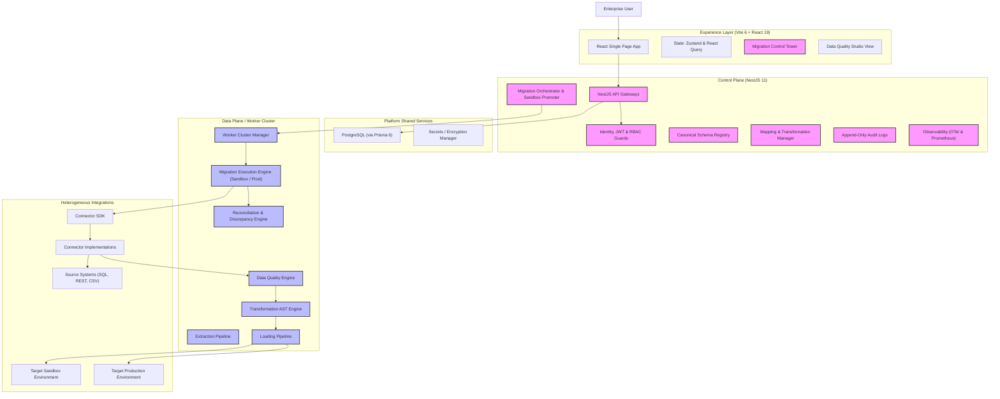

# EDIMP Application Architecture Reference

This document provides a detailed overview of the system architecture of the **Enterprise Data Integration & Migration Platform (EDIMP)**. It serves as a blueprint for onboarding developers and designing future enhancements.

---

## 🏛️ High-Level System Architecture

EDIMP is designed around the separation of the **Control Plane** (orchestration, security, metadata) and the **Data Plane** (data heavy lifting, transformation, execution).



---

## 📁 Repository & Monorepo Structure

EDIMP is structured as an enterprise **Turborepo** monorepo:

```text
EDIMP/
├── apps/
│   ├── api/                   # NestJS 11 Backend API Service (Port 3001)
│   │   ├── src/
│   │   │   ├── tenants/       # Multi-Tenancy Management (Tenant, Member)
│   │   │   ├── workspaces/    # Workspace Scope
│   │   │   ├── environments/  # Environment Contexts (Dev, Sandbox, Prod)
│   │   │   ├── connections/   # Connections & Data Profilers
│   │   │   ├── data-models/   # Extracted Data Schema Definitions
│   │   │   ├── canonical-models/# Target System Canonical Schemas
│   │   │   ├── mapping-sets/  # Source-to-Target Entity/Field Maps
│   │   │   ├── transformations/# AST Safe Expression Engine (AST-based maps)
│   │   │   ├── data-quality/  # [NEW] Completeness, Validity, Uniqueness rules
│   │   │   ├── pipeline-jobs/ # Worker Batch Jobs & Lease Management
│   │   │   ├── worker-cluster/# Distributed Cluster Worker Nodes
│   │   │   ├── migration-engine/# Core migration ETL orchestrator with Sandbox Support
│   │   │   ├── reconciliation/# Discrepancy Reconciliation Engine
│   │   │   ├── ai-agents/     # Gemini-powered Auto-mapping & Drift Analysis
│   │   │   └── observability/ # Prometheus Metrics & OTEL Trace Interceptors
│   │   └── test/              # Comprehensive Phase 1-8 E2E Test Suite
│   └── web/                   # Vite 6 + React 19 Web Client (Port 3000)
│       ├── src/
│       │   ├── components/    # 130+ Modular views and components
│       │   │   ├── DataQualityStudio.tsx # Data Quality Rules Dashboard
│       │   │   ├── MigrationSandbox.tsx  # Simulation & Approval Views
│       │   │   └── ControlTower.tsx      # Executive Executive Dashboard
│       │   ├── store/         # Zustand Stores (uiStore, useAppStore)
│       │   ├── api/           # API fetch contracts for backend communication
│       │   └── services/      # Offline caching, RBAC validation
│       └── tailwind.config.ts # Design System Configuration
└── packages/
    ├── contracts/             # Shared Zod Validation schemas and DTO contracts
    └── database/              # Prisma 6 Schema & Migrations
```

---

## 🔒 Multi-Tenant & Hierarchical Isolation Model

EDIMP strictly isolates data through a 3-tier organization structure:
$$\text{Tenant} \longrightarrow \text{Workspace} \longrightarrow \text{Environment}$$

- **Tenant Isolation**: Every database table representing tenant data contains a `tenantId`. NestJS requests resolve user credentials, and database queries are strictly scoped to the user's tenant ID.
- **Workspace Scope**: Migration projects, schemas, and configurations live within a workspace.
- **Environment Isolation**: Connectors and migrations execute under specific environments (e.g., Development, Sandbox, Production). Production environments enforce stricter execution rules, approval steps, and audit tracking.

---

## ⚙️ Control Plane vs. Data Plane Separation

### 1. The Control Plane (NestJS API Gateway)
- **Duties**: Authentication (JWT & OIDC/Entra ID), authorization, metadata storage, project definition, API orchestration, metrics exposition, sandbox-to-production promotion approvals, and auditing.
- **Core Technology**: NestJS 11, Prisma 6 ORM, Zod validator, passport-jwt.

### 2. The Data Plane (Worker Cluster & Migration Engine)
- **Duties**: Schema discovery, data extraction, validation, data quality profiling, AST transformation, bulk sandbox/production target loading, and discrepancy reconciliation.
- **Core Technology**: Node.js worker polling processes, lease management (`WHERE status = 'QUEUED' OR leaseExpiresAt < NOW()`), memory-safe streaming, and connector adapters.

---

## 🛠️ Main Backend Module Architecture

Each backend module inside [`apps/api/src`](file:///c:/Users/Fayas/Downloads/Dev/Projects/EDIMP/apps/api/src) follows a layered architecture (Controller $\rightarrow$ Service $\rightarrow$ Prisma/Database).

| Module Name | File Reference | Primary Responsibility |
|---|---|---|
| **Tenants & Workspaces** | [`tenants`](file:///c:/Users/Fayas/Downloads/Dev/Projects/EDIMP/apps/api/src/tenants) | Handles tenants, workspace hierarchies, user role assignments, and RBAC guards. |
| **Connections** | [`connections`](file:///c:/Users/Fayas/Downloads/Dev/Projects/EDIMP/apps/api/src/connections) | Registers connectors, executes connection health checks, and profiles remote database engines. |
| **Data Models** | [`data-models`](file:///c:/Users/Fayas/Downloads/Dev/Projects/EDIMP/apps/api/src/data-models) | Schema Registry. Stores representations of remote tables/endpoints. |
| **Data Quality & Studio** | [`data-quality`](file:///c:/Users/Fayas/Downloads/Dev/Projects/EDIMP/apps/api/src/data-quality) | Tracks metrics (Completeness, Validity, Uniqueness, Consistency, Referential Integrity). Manages Rule overrides (Fix $\rightarrow$ Preview $\rightarrow$ Approve $\rightarrow$ Apply). |
| **Canonical Models** | [`canonical-models`](file:///c:/Users/Fayas/Downloads/Dev/Projects/EDIMP/apps/api/src/canonical-models) | Establishes the intermediary data model representing the target domain (e.g., Customer, Invoice). |
| **Mapping Sets** | [`mapping-sets`](file:///c:/Users/Fayas/Downloads/Dev/Projects/EDIMP/apps/api/src/mapping-sets) | Contains field mappings, lookup tables, and mapping validations. |
| **Transformations** | [`transformations`](file:///c:/Users/Fayas/Downloads/Dev/Projects/EDIMP/apps/api/src/transformations) | Custom safe AST expression evaluator (zero `eval()` vulnerability) executing clean mapping rules. |
| **Migration Engine** | [`migration-engine`](file:///c:/Users/Fayas/Downloads/Dev/Projects/EDIMP/apps/api/src/migration-engine) | Coordinates the steps of a migration pipeline run (Extract $\rightarrow$ DQ $\rightarrow$ Transform $\rightarrow$ Load) under Sandbox/Production targets with Promotion Gates. |
| **Worker Cluster** | [`worker-cluster`](file:///c:/Users/Fayas/Downloads/Dev/Projects/EDIMP/apps/api/src/worker-cluster) | Implements worker registration, lease management, health-checks, and parallel job processing. |
| **Reconciliation** | [`reconciliation`](file:///c:/Users/Fayas/Downloads/Dev/Projects/EDIMP/apps/api/src/reconciliation) | Performs post-migration hashes comparison, discrepancy logging, and generates delta patches. |
| **AI Agents** | [`ai-agents`](file:///c:/Users/Fayas/Downloads/Dev/Projects/EDIMP/apps/api/src/ai-agents) | Integrates with Google Gemini LLMs for AI schema recommendations and mapping templates. Includes rule-based engine fallbacks on rate-limits (HTTP 429). |
| **Observability** | [`observability`](file:///c:/Users/Fayas/Downloads/Dev/Projects/EDIMP/apps/api/src/observability) | Implements W3C traceparent propagation, Prometheus metric logging (`/api/v1/metrics`), and audit trail archiving. |

---

## 🎨 Frontend Architecture

The frontend is a modern SPA designed for premium user experience, responsiveness, and performance.

### 1. Route Configuration & Code Splitting
Top-level views (e.g., [`MappingStudioView`](file:///c:/Users/Fayas/Downloads/Dev/Projects/EDIMP/apps/web/src/components/MappingStudioView.tsx), [`MigrationWizardView`](file:///c:/Users/Fayas/Downloads/Dev/Projects/EDIMP/apps/web/src/components/MigrationWizardView.tsx)) are lazy-loaded via `React.lazy()` and `Suspense` in [`App.tsx`](file:///c:/Users/Fayas/Downloads/Dev/Projects/EDIMP/apps/web/src/App.tsx) to minimize the initial Javascript payload.

### 2. State Management System
- **Server State**: Managed via `@tanstack/react-query` to handle caching, background refresh, loading status, and error states when talking to NestJS API endpoints.
- **Client UI State**: Managed using `Zustand` (`uiStore.ts` and `useAppStore.ts`) to avoid deep prop drilling and cleanly control global elements (e.g., theme, sidebar collapse status, shortcuts toggles).
- **Offline Caching**: Built with `localStorage`-backed caches to allow off-network read access for active mapping sets and connector lists.

### 3. Data Visualization & Dashboarding
- **D3.js & SVG Graphs**: Interactive dependency charts and mapping links.
- **Migration Control Tower**: High-level consolidated executive dashboard displaying overall statistics (Active migrations, Records processed, Success rate, Reconciliation rates, Data Quality index) alongside graphical progress indicators.

---

## ⚙️ How to Develop Further

When building new features, adhere to the following development lifecycle guidelines:

1. **Keep Types Synchronized**: Always define schemas and models first in the [`contracts`](file:///c:/Users/Fayas/Downloads/Dev/Projects/EDIMP/packages/contracts) package using Zod, then import them into both the frontend and backend.
2. **Database Changes**: Update the schema in [`schema.prisma`](file:///c:/Users/Fayas/Downloads/Dev/Projects/EDIMP/packages/database/prisma/schema.prisma) and run `npx prisma migrate dev` from the `packages/database` folder.
3. **Control/Data Plane Scoping**: Do not put data-crunching or remote API execution logic in NestJS controllers or services. Delegate them to a queue task or a worker execution thread.
4. **Multi-Tenant Scoping**: Always obtain the active tenant context using the NestJS authenticated request token; never allow raw client-supplied parameters to override tenant scoping.
